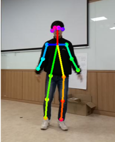
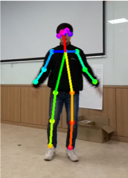
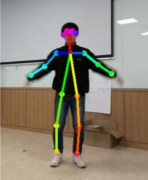
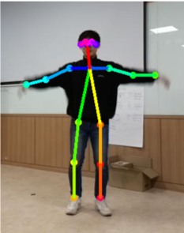
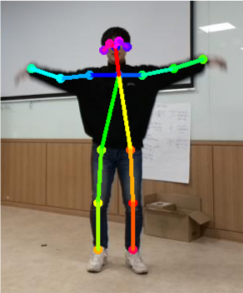
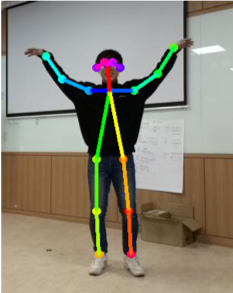

# AI스피커 기반 모션인식 게임 <br>

카메라, 디스플레이가 탑재된 AI스피커 구현<br>
키즈를 대상으로 한 모션 인식 키즈콘텐츠 게임 구현 <br>

### 사용 스택 <br>

`Python` `tensorflow` `Raspberry PI`

<br>

### 관절 추출 오픈소스
```
tf-pose
```

### 모션 인식 모델
```
LSTM
```








소스코드 [DropTheBeat][dropthebeat-gh]

[dropthebeat-gh]:   https://github.com/koseokkyu/AI_tfPose_Project
